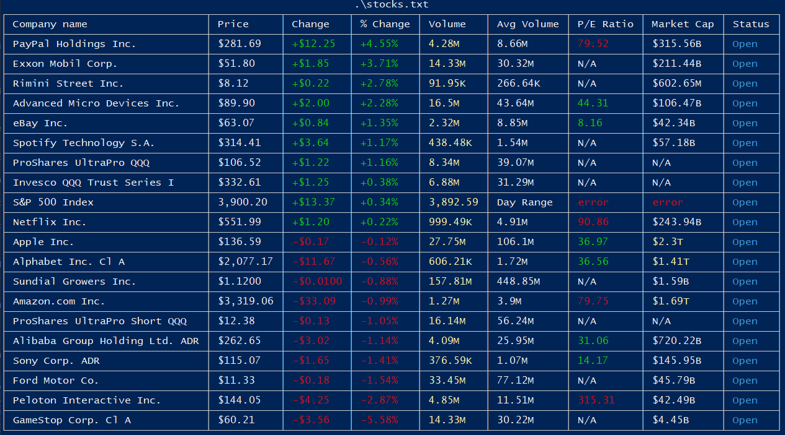

# Stock terminal

Just a console application to get stock prices using soup web scraping and displays on the terminal using the rich python library. It's my first time using web scraping so the code is very messy.

